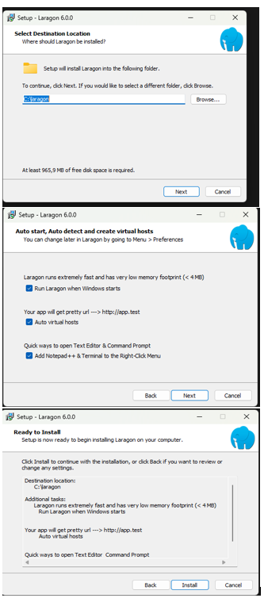
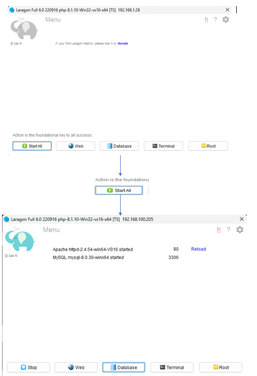
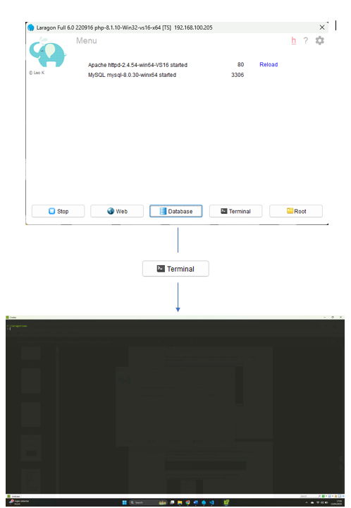
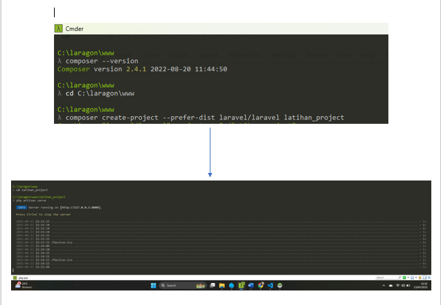

# 📘 Panduan Lengkap Instalasi Laravel 11 Menggunakan Laragon

Dokumen ini berisi langkah-langkah lengkap untuk menginstal Laravel 11 menggunakan Laragon, mulai dari setup awal hingga project berhasil dijalankan di browser.

---

## 🛠 1. Install Laragon

Unduh Laragon dari situs resminya:

🔗 [https://laragon.org](https://laragon.org)

Lalu lakukan instalasi seperti biasa hingga selesai.

---

## ⚙️ 2. Jalankan Laragon

Setelah Laragon terinstal, buka aplikasinya dan klik tombol **Start All** untuk menyalakan semua service (Apache, MySQL, dsb).

---

## 💻 3. Buka Terminal Laragon

Klik menu **Terminal** di Laragon untuk membuka terminal bawaan. Ini akan membuka command prompt yang sudah diarahkan ke folder kerja Laragon (`C:\laragon\www`).

---

## 🧪 4. Cek Composer

Pastikan Composer sudah terinstal di sistem kamu. Jalankan perintah berikut:

🚀 5. Buat Project Laravel

Masuk ke folder www Laragon (jika belum otomatis), lalu jalankan perintah:

bash
cd C:\laragon\www
Kemudian buat project Laravel dengan perintah:

bash
composer create-project laravel/laravel:^11.0 nama-project
Gantilah nama-project dengan nama yang kamu inginkan.

📂 6. Masuk ke Folder Project dan Jalankan
Setelah proses selesai, masuk ke folder project:

bash
cd nama-project
Lalu jalankan Laravel menggunakan perintah artisan:

``bash
php artisan serve
Laravel akan aktif di:
http://localhost:8000
Jika kamu menggunakan Laragon, domain otomatis juga bisa seperti:
http://nama-project.test

🌐 7. Buka di Browser
Buka browser kamu, lalu akses salah satu URL berikut:

http://localhost:8000

http://nama-project.test (jika menggunakan fitur auto virtual host Laragon)

✅ Selesai!
Sekarang kamu sudah berhasil:

✔️ Menginstal Laragon

✔️ Mengecek Composer

✔️ Membuat Project Laravel 11

✔️ Menjalankan Laravel di browser

Selamat ngoding Laravel 🎉

